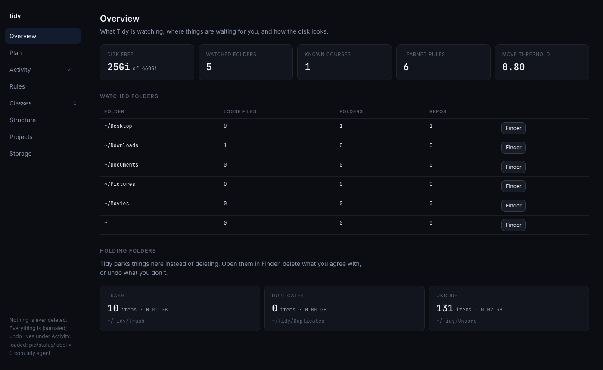

<div align="center">
  <h1>Tidy</h1>
  <p><em>Keeps your Mac organized. Rules first, a decision model for the rest, nothing ever deleted.</em></p>
</div>

<p align="center">
  <a href="https://github.com/AkhilBod/Tidy/stargazers"></a>
  <a href="LICENSE"></a>
  
  
  
</p>

<p align="center">
  
</p>

> Tidy watches Desktop, Downloads and Documents, works out what each file *is* and where it belongs, and files it there. Screenshots, resumes, coursework, datasets, installers, repos. It moves things in a journaled, undoable way, and anything it isn't sure about is parked in a folder you can see, never deleted.

## Why

Desktop is 40 loose folders. Downloads is 100 files deep. Every screenshot ever taken is still on the Desktop. Existing organizers are either dumb (rules on extensions) or creepy (upload your files).

Tidy sits between those:

- **Deterministic first.** Screenshots, exact duplicates, installers for apps you already have, extracted zips, empty folders, course codes in filenames: no model needed, and none is used.
- **A decision model, not a chatbot, for the rest.** [Jev](https://docs.typesafe.ai) answers "which of these categories, and how sure are you?" from the filename and metadata. It never sees file contents, never generates text, and is only trusted above a confidence you set.
- **Never deletes.** Junk goes to `~/Tidy/Trash`, copies to `~/Tidy/Duplicates`, doubts to `~/Tidy/Unsure`. You empty them.
- **Everything undoable.** Every move is journaled. `tidy undo` puts the last batch back; the UI undoes any single item.
- **Learns from you.** Fix one wrong call and it becomes a rule that beats every heuristic next time.

## Quick start

```bash
git clone https://github.com/AkhilBod/Tidy.git && cd Tidy
npm install
mkdir -p ~/.config/tidy && echo 'TYPESAFE_API_KEY=your-key' > ~/.config/tidy/env && chmod 600 ~/.config/tidy/env

bin/tidy init      # looks at your Mac, proposes a config, moves nothing
bin/tidy plan      # dry run: what would happen
bin/tidy ui        # the app: review, apply, undo, edit rules
```

Node 22.6 or newer (it runs the TypeScript directly, no build step). macOS only. Put `bin/` on your `PATH` or `npm link`.

Keep it running in the background:

```bash
bin/tidy agent install   # launchd: on changes to watched folders + daily at 03:00
```

Then grant `node` Full Disk Access in System Settings → Privacy & Security, or the agent can't read Desktop and Downloads.

## What it does

| You have | Tidy puts it in |
|---|---|
| `Screenshot 2026-06-13 at 2.14.13 PM.png`, screen recordings | `~/Pictures/Screenshots/2026-06/`, `~/Movies/Recordings/2026-06/` |
| Resumes, offer letters, cover letters, application exports | `~/Documents/Career/{Resumes, Offers, Cover Letters, Applications}/` |
| `CS1555_HW3.pdf`, `lab3-report.docx`, `Assignment 4.pdf` | `~/Documents/School/<Institution>/<Course>/Homework/HW3/` |
| `HW3.sql`, `starter.sql`, class repos | `~/Code/school/<Course>/…` |
| Lease, tax, bank, insurance paperwork | `~/Documents/Finance-Legal/` |
| Datasets, installers, mail and Takeout exports | `~/Archive/{Datasets, Installers, Exports}/` |
| Git repos and project folders | `~/Code/{personal, school, work, research, experiments, archive}/<slug>/` |
| `file (1).pdf` identical to `file.pdf` | `~/Tidy/Duplicates/` |
| Installer for an app already in /Applications, extracted zip, `__MACOSX`, empty folder | `~/Tidy/Trash/<reason>/` |
| Anything it isn't confident about | `~/Tidy/Unsure/` and the Plan tab, waiting for you |

`HW3.pdf` next to `HW3-final.pdf` with different contents? Both stay put and go to review. Tidy never guesses which revision matters.

```
$ tidy plan --root ~/Downloads
hold   rule ~/Downloads/Claude.dmg -> ~/Tidy/Trash/Installed apps/Claude.dmg  [installer for an app already in /Applications]
hold   rule ~/Downloads/Internship Offer (1).pdf -> ~/Tidy/Duplicates/Downloads/Internship Offer (1).pdf  [exact duplicate of Internship Offer.pdf]
move   rule ~/Downloads/CS1555_HW3.pdf -> ~/Documents/School/University of Pittsburgh/CS1555/Homework/HW3/CS1555_HW3.pdf  [school CS1555 homework HW3 (filename)]
move   rule ~/Downloads/HW3.sql -> ~/Code/school/CS1555/homework/hw3/HW3.sql  [school CS1555 homework HW3 (siblings), grouped with 1 sibling(s)]
move   1.00 ~/Downloads/Rental Application.pdf -> ~/Documents/Finance-Legal/Rental Application.pdf  [finance_legal]
move   0.95 ~/Downloads/IMG_3166.heic -> ~/Pictures/Personal/2026/IMG_3166.heic  [media]
review 0.62 ~/Downloads/unnamed.png  [category junk below 0.8]

4 move, 2 to holding (0.58 GB), 1 review, 0 skip
```

## The app

`tidy ui` serves a local page at `127.0.0.1:4848` (nothing leaves the machine).

| Tab | What you do there |
|---|---|
| **Overview** | Disk, watched folders, the three holding folders with one-click Finder |
| **Plan** | The dry run as a checklist. Uncheck what you disagree with, apply the rest. Every unsure row has an inline form: pick a category, a course + type + assignment, or a folder, and Tidy moves it *and learns the rule* |
| **Activity** | Every move ever made, grouped by batch. Undo one item or a whole batch |
| **Rules** | The live config: watched folders, thresholds, destinations, every category (what the model is told, where it goes, on/off), project buckets, school layout, protected names, learned corrections |
| **Classes** | Your courses and their aliases |
| **Structure** | Every destination and what is in it right now |
| **Projects** | Repos still sitting in watched folders, a bucket per row, move checked |
| **Storage** | Reclaimable space: `node_modules`, `.next`, `.venv`, caches, stale archives, with size, date and why |

## School

Most organizers stop at "school folder". Tidy knows which class.

`~/.config/tidy/classes.json` is a course registry; `tidy init` proposes courses whose codes recur in your filenames, and you add the rest:

```bash
tidy class add --code CS1555 --name "Database Management Systems" --institution "University of Pittsburgh"
tidy class alias CS1555 "db systems" dbms
```

Any spelling works: `CS1555`, `CS 1555`, `cs-1555`, `15-213`, `6.006`, `BIO101`. Routing only ever targets registered courses, so `IMG_1555.jpg` is never mistaken for a class.

A file is pinned to a course by, in order:

1. its own name (`cs1555_hw3.pdf`)
2. its parent folder (`~/Desktop/CS 1555/`)
3. its neighbours: a bare `HW3.pdf` next to `cs1555-lecture7.pdf` and `CS 1555 schema.sql`
4. a rule you taught it
5. the model, with the course list as the choices

Type (`homework`, `lab`, `lecture`, `exam`, `syllabus`, `notes`, `study_guide`, …) and assignment (`HW3`, `Lab4`, `Project2`, `Midterm`) come from the name. Files of one assignment from one folder stay together, even when one is a PDF and one is SQL. An assignment folder moves whole.

Wrong call? Teach it once, in the UI or:

```bash
tidy resolve ~/Tidy/Unsure/Downloads/hw4.pdf --course CS1555 --type homework --assignment HW4 --learn-prefix
```

## Configuration

Everything personal lives in `~/.config/tidy/`, so the code has no idea who you are.

```
config.json    roots, destinations, thresholds, categories, project buckets, school layout
classes.json   your courses
learned.json   your corrections
env            TYPESAFE_API_KEY
```

`config.json` is merged over the defaults in [`src/config.ts`](src/config.ts). A few things people change:

```json
{
  "roots": ["~/Desktop", "~/Downloads", "~/Documents"],
  "inbox": { "roots": ["~/Downloads"], "graceDays": 1 },
  "thresholds": { "move": 0.8, "hold": 0.9 },
  "destinations": { "code": "~/Projects", "screenshots": "~/Pictures/Screenshots" },
  "categories": {
    "career_resume": { "destination": "{career}/Resumes" },
    "media": { "enabled": false }
  },
  "code": { "buckets": ["personal", "work"], "containers": { "personal projects": "personal" } },
  "school": {
    "docsTemplate": "{school}/{course}/{typeDir}/{assignment}",
    "codeTemplate": "{code}/school/{course}"
  }
}
```

Destination templates use `{destinationKey}`, `{yyyy}`, `{mm}`, `{project}`, `{institution}`, `{course}`, `{typeDir}`, `{assignment}`; empty parts collapse. A category with no destination only ever goes to review. A name in `protected` is never entered or moved. The Rules tab edits all of this.

## Commands

```
tidy init [--dry-run] [--force]   discover folders, repos, courses; write config + classes
tidy plan [--root DIR]...         dry run (--all shows skipped items)
tidy apply [--root DIR]...        move, journal
tidy undo [--last N|--since ISO|--all]
tidy ui [--port 4848]             the app
tidy repos [--apply]              project folders -> ~/Code; --only PATH --bucket NAME --allow-dirty
tidy clean [--apply]              reclaimable storage; --apply parks the safe tier in ~/Tidy/Trash/Reclaim
tidy holding [--open]             sizes of Trash / Duplicates / Unsure
tidy resolve PATH ...             move one item and learn the rule
tidy class list|add|edit|remove|alias
tidy links [--remove]             symlinks left at old repo paths
tidy report                       weekly markdown report
tidy agent install|uninstall|status
tidy config
```

## Safety

- **Top level only.** Tidy never reaches inside a folder except to summarize it. Folders move whole or not at all.
- **Leaves alone:** `~/Library`, `.app` bundles, Photos libraries, hidden folders, protected names, anything modified in the last 10 minutes, partial downloads, files another process has open, anything already in a Tidy destination.
- **Repos:** move only when no process has its working directory inside; uncommitted changes travel with the folder (or block the move, your choice); HEAD is verified after; files that spell out the old absolute path are reported; Claude Code project memory follows the repo.
- **Storage:** only regenerable folders in projects untouched for months are "safe" to park. Caches are reported, never touched.
- **Privacy:** the model sees `{filename, extension, size bucket, age in days, folder name, sibling filenames}`. Never contents. The only host contacted is `api.typesafe.ai`; the key stays in `~/.config/tidy/env`.
- **Cost:** Jev bills input only, at fractions of a cent per thousand files. A full pass over a cluttered Mac is a few cents. Answers are cached per file, so re-runs are free.

## How it works

```
src/scan.ts       facts about each top-level item (name, size, age, siblings, git state)
src/rules.ts      deterministic pass: duplicates, revisions, screenshots, installers, debris
src/classes.ts    course registry + tolerant code matching
src/school.ts     coursework type, assignment id, course inference, destinations
src/learned.ts    corrections that override everything else
src/questions.ts  what the model is asked, built from your categories and courses
src/plan.ts       facts -> actions (move / hold / review / skip), assignment grouping
src/act.ts        journaled moves;  src/undo.ts replays the journal backwards
src/repos.ts      project folder moves with the safety checks above
src/clean.ts      reclaimable storage
src/init.ts       discovery and bootstrap
src/agent.ts      launchd
src/ui/           the local app (one HTML file, one server file, no framework)
```

`npm test` runs the fixture suite. No network, no real files touched.

## License

MIT. Use it, fork it, point it at your own model. If it saves your Desktop, a star helps other people find it.
